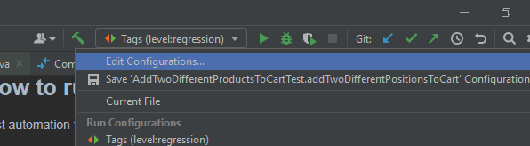
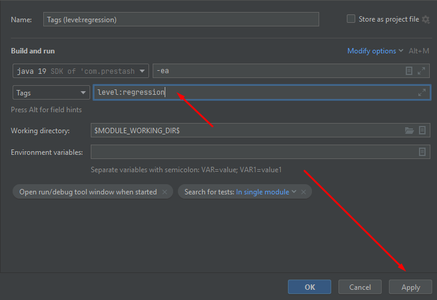
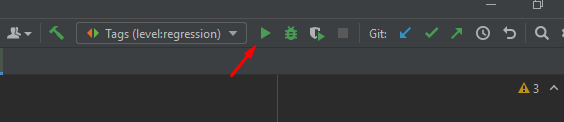

# Test Automation Framework [TAF] - Prestashop [Proof of concept]

1. [Overview](#overview)
2. [How to run tests - locally](#how-to-run-locally)
3. [Technical backlog](#tech-backlog)

---

## Overview 

Time spent: 16h

This is not the final version of the framework, but only POC. Any solution can be discussed and finalized in the future.
Necessary refactorings and architecture improvements can be found in "Technical backlog" section.

## How to run tests - locally 

Test automation framework allows to run tests:

---

## Technical backlog: 

* It is necessary to finalize the work with 'switching iframe content'. In this solution we have to think about
  switching between iframe and default contents, I would like the framework to take care of this without our inputs.
* Integrate a report system in the framework. For example: Allure, Report Portal or something like this.
* Add description of steps e.g. @Step annotation from allure allows you to add detailed description, or we can consider
  other approaches e.g. BDD framework.
* Need to improve navigation between forms and pages and implement proper dependencies and relationships.
* Tests can also be split into private methods with clear names for easier reading and understanding.

Always open to suggestions and improvements!